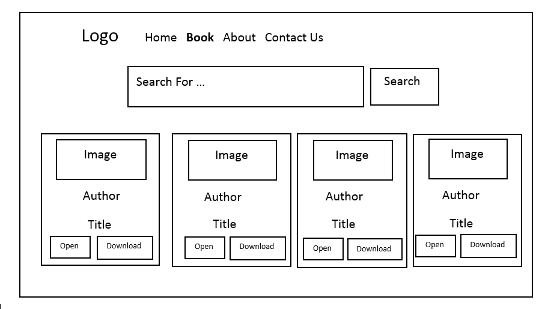

# Project Title

Read It

## Description

Read it is a social cataloging website that allows individuals to freely search of books , open it or download it
### Technical Used
React
api

### Wireframes
Home page

Book Page

Search a book in book page

About Page

Contact Page

### User Stories
As Reader,I would like a Home page with display Quote
As Reader,I would like a book page with search bar to search about the specific book and open it or download it.
As Reader,I would like a contact page to send a message to the admin
As Reader,I would like a about page

## Planning and Development Process

Day1: searched about an api and designed a web app
Day2-Day3: Fetched data from api and display them on web page

### Problem-Solving Strategy

I used " console.log()" to check if there is Problem in any function!
